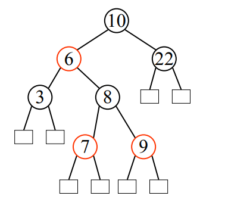
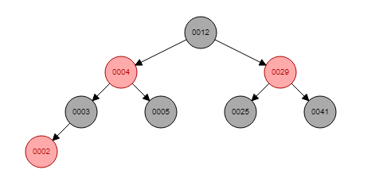
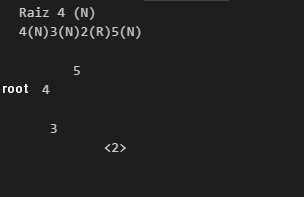
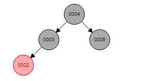

# Red_Black_Tree
Red Black Tree - Estrutura de Dados

Arvore Rubro Negra Desenvolvida durante a disciplina de Estrutura de dados nao lineares em Java.

(Academic)  
Red black tree developed in the discipline of nonlinear data structure at the federal institute of education and technology of RN.

[Insertion](https://www.cs.usfca.edu/~galles/visualization/RedBlack.html) of the elements that are in the test class to compare:  

Running the test class with the elements to be removed (this is how the output appears):  

[Compare](https://www.cs.usfca.edu/~galles/visualization/RedBlack.html) removing the elements of the test class:  

